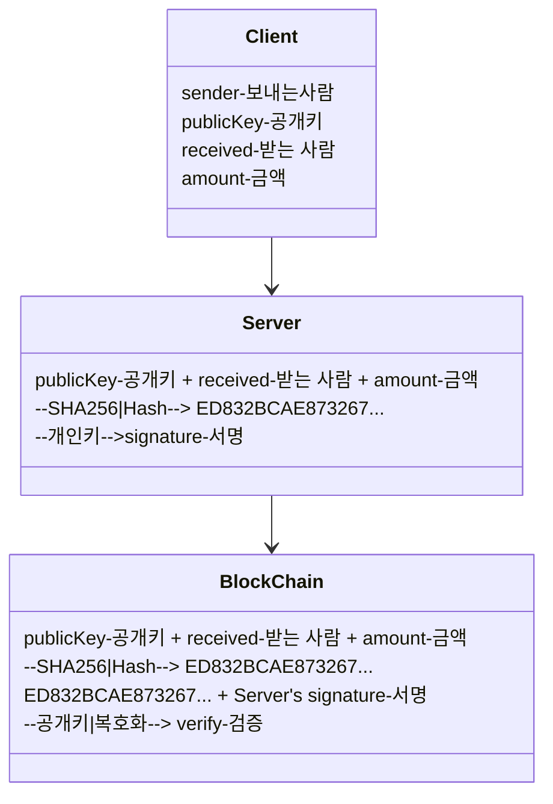

# 지갑 서버

- 왜 서버를 따로 만드느냐? => 보안때문이다. 아무나 블록체인에 블록이나 트랜잭션을 추가할 수 없도록 하기 위해서 중간 단계에서 서버를 거친다.

```mermaid
    classDiagram
    Client-->Server
    Server-->BlockChain
    class Client{
        sender-보내는사람
        publicKey-공개키
        received-받는 사람
        amount-금액
    }
    class Server{
        publicKey-공개키 + received-받는 사람 + amount-금액
        --SHA256|Hash--> ED832BCAE873267...
        --개인키-->signature-서명
    }
    class BlockChain{
        publicKey-공개키 + received-받는 사람 + amount-금액
        --SHA256|Hash--> ED832BCAE873267...
        ED832BCAE873267... + Server's signature-서명
        --공개키|복호화--> verify-검증
    }
```
